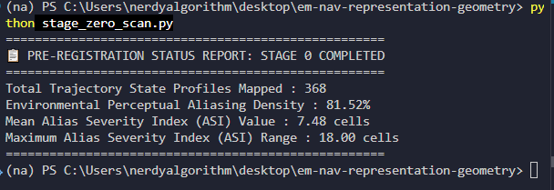
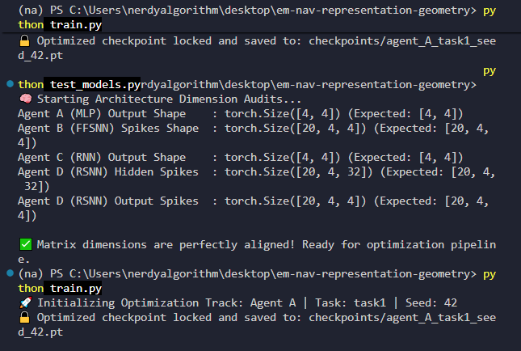

# **EM-NAV Project Tracking Log & To-Do List**

**Author:** Angelic Charles  
**Document Type:** Interactive Verification Pipeline & Task Checklist

---

**Phase 0: Informational Baseline & Environment Scan**

* [X] Initialize MiniGrid simulation environment platform.  
* [X] Implement custom EgocentricRaycastWrapper to enforce the 5-ray proximity stream.  
* [X] Strip away all global coordinate vectors, bird's-eye feeds, and absolute heading orientation maps.  
* [X] Run the self-contained baseline `execute_stage_zero_scan(maze_size=12)` script.  
* [X] **Log Scan Outputs:**  
  * Total Trajectory State Profiles Mapped: 368   
  * Environmental Perceptual Aliasing Density %: 81.52% 
  * Mean Alias Severity Index (ASI) Value: 7.48 cells  
  * Maximum Alias Severity Index (ASI) Range: 18.00 cells

---

**Phase 1: Neural Architecture & Optimization Pipeline**

### **Ablation Matrix Construction (Hidden Population Width $H = 32$)**

* [X] **Agent A (Dense MLP Baseline):** Implement feedforward network with continuous activations (ReLU).  
* [X] **Agent B (Feedforward SNN):** Build feedforward spiking network with snnTorch Leaky Integrate-and-Fire (LIF) units and fast-sigmoid surrogate gradients over a temporal window of $T = 20$.  
* [X] **Agent C (Recurrent RNN Baseline):** Implement continuous RNN cell architecture providing persistent hidden storage loops ($H \leftrightarrow H$).  
* [X] **Agent D (Recurrent SNN / RSNN):** Construct fully recurrent spiking network integrating hidden LIF loops and a strict $L_1$ activity regularization penalty.

### **PPO Optimization Track Execution**

* [X] **Task 1 (Invisible Goal Navigation):** Set up blind search paradigm with zero proximity telemetry and time-discounted scalar rewards ($R = \gamma^{\text{steps}}$).  
* [X] **Task 2 (Intrinsic Curiosity Coverage):** Configure space-filling novelty optimization track utilizing space-occupancy tracking metrics ($R_t = 1 / \sqrt{N(x, y)}$).  

* [X] Deploy optimization runs across 3 independent random seeds per configuration (24 unique training runs, $1 \times 10^6$ steps each).  
* [X] Lock and save optimized network checkpoint configuration files (.pt format).

---

**Phase 2 & 3: Content and Geometric Characterization**

* [X] Permanently freeze all network synaptic weights following the completion of the training blocks.  
* [X] Execute 5,000-step pure evaluation runs to harvest activation vectors.  
* [X] **Stage 2 (Linear Probing Content Check):** Train an un-tuned linear ridge regression probe to decode absolute continuous $(x, y)$ coordinate sets. Evaluate Mean Squared Error (MSE) and 5-Fold Cross-Validation $R^2$.  
* [X] **Stage 3 (Geometric Manifold Alignment Mapping via Tri-RSA):**  
  * [X] Compute population-level Representational Dissimilarity Matrices (RDMs) using correlation distances ($1 - \text{Pearson's } r$).  
  * [X] Construct competitive hypothesis models (Sensorimotor Proximity, flat Euclidean, and Navigable Geodesic path layouts).  
  * [X] Run rank correlation profiles (Kendall's $\tau$) across all four architectures to determine structural alignment.

---

**Phase 4 & 5: Single-Unit Metrics & Scientific Decision Gate**

* [X] **Stage 4 (Single-Unit Firing Analysis):** Generate standard 2D spatial firing rate heatmaps for each of the 32 hidden neurons across all architectures.  
* [X] Score spatial tuning density profiles using the Skaggs Spatial Information Index ($I$).  
* [X] Execute 1,000-iteration temporal time-shift shuffle null controls to isolate true place cell profiles (>95th percentile).  
* [ ] **Stage 5 (The Critical Scientific Decision Gate):** Verify if the Tri-RSA rank indicators and linear decoders show clear coordinate formatting and architecture-dependent variance.  
  * *Decision: If passed, unlock Phase 6. If failed, pivot directly to comprehensive Failure Analysis.*

---

**Phase 6: Hierarchical Representation Transfer Engine**

* [ ] Port frozen PPO control weights zero-shot into the **Continuous Sensorimotor Evaluation Environment (Blender 5.x)**.  
* [ ] Bind the 5-ray physical proximity cast pipeline using native `scene.ray_cast` momentum logic.  
* [ ] **Transfer Level 1 (Engine Shift Invariance):** Evaluate model robustness against continuous continuous physics noise and implementation changes in the identical FourRooms layout.  
* [ ] **Transfer Level 2 (Morphological Invariance):** Stress-test the models by elastically stretching or compressing corridor boundaries by $\pm 20\%$.  
* [ ] **Transfer Level 3 (Topological Generalization):** Drop frozen agents zero-shot into an entirely unseen complex maze framework.  
* [ ] Log **Representational Drift Indexes (RDI)** by cross-correlating the Geodesic RDM before and after transfer.