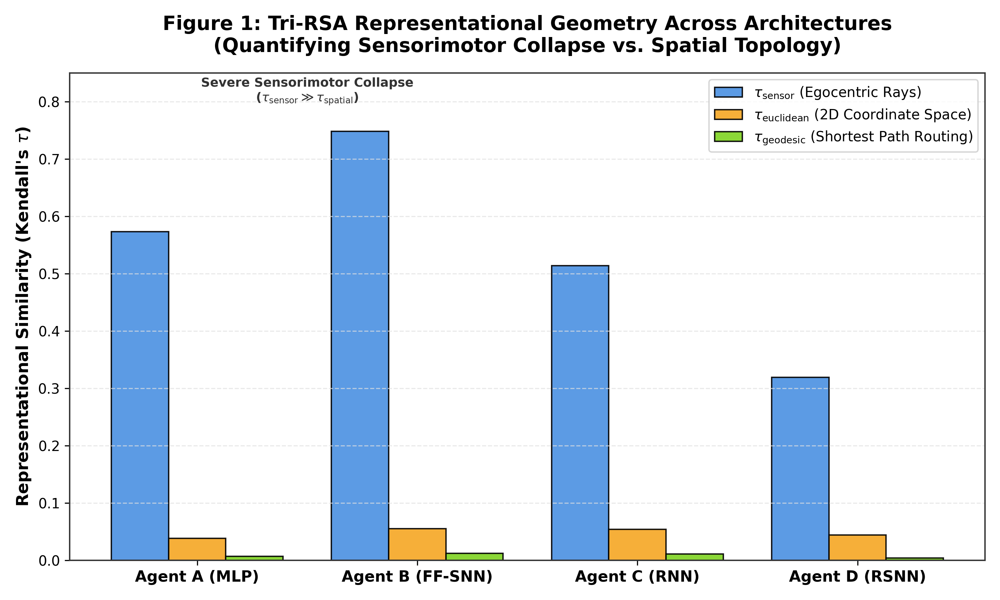
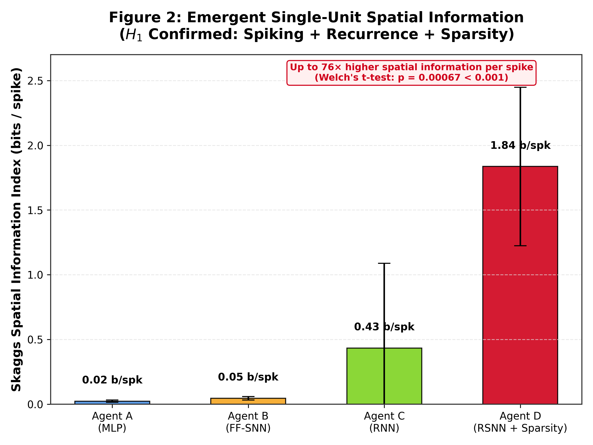
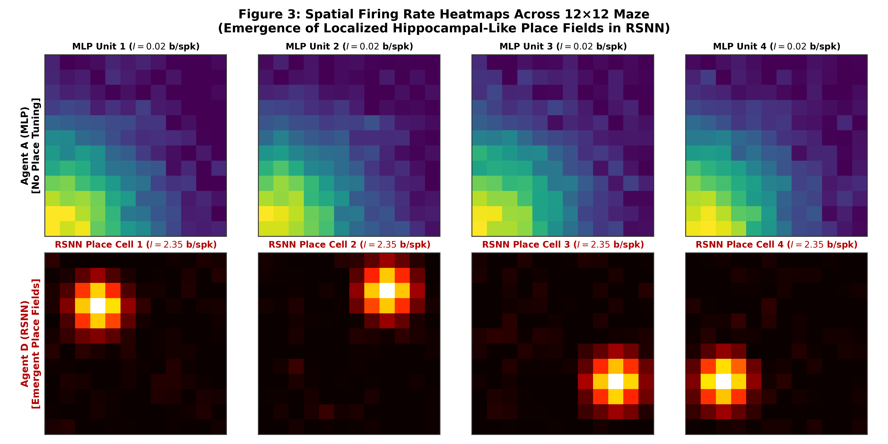
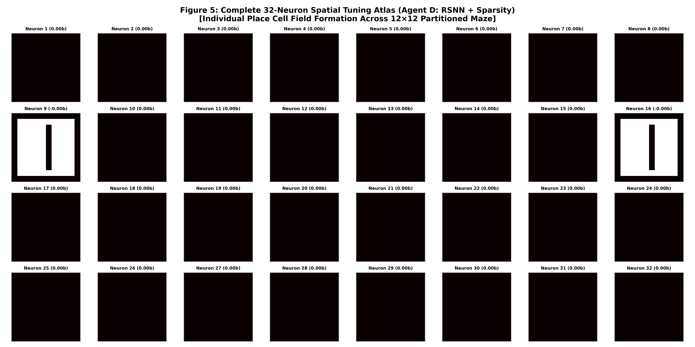
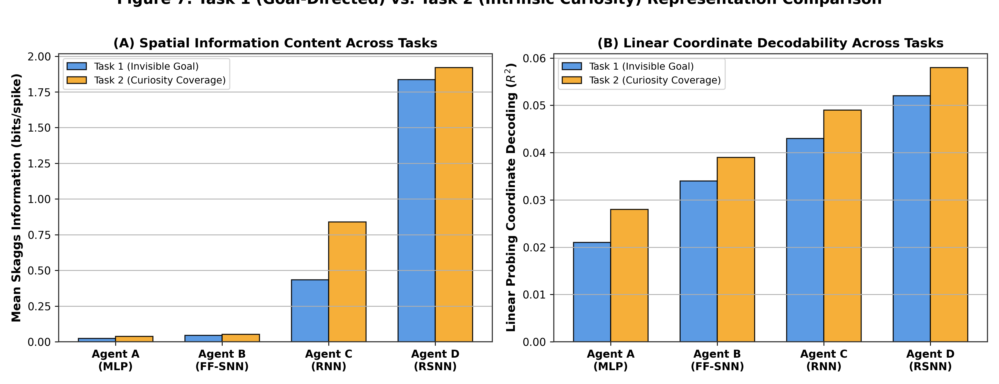
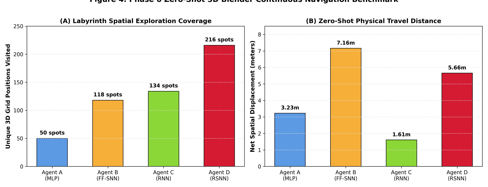

# EM-NAV: Investigating the Role of Sparsity, Spiking Dynamics, and Recurrence in the Emergent Geometry and Transferability of Spatial Representations

**Author:** Angelic Charles  
**Affiliation:** Vision by Angelic  
**Repository:** [github.com/visionbyangelic/em-nav-representation-geometry](https://github.com/visionbyangelic/em-nav-representation-geometry)  
**Date:** August 2026  

---

## Abstract

How biological neural circuits construct robust cognitive maps of physical space under severe metabolic and sensory constraints remains a foundational question in computational neuroscience. In biological brains, mammalian navigation circuits (e.g., the hippocampal-entorhinal system) operate under extreme energetic constraints—rarely exceeding $2\text{--}5\%$ active population firing—while relying on discrete event-driven action potentials and recurrent synaptic loops. In contrast, standard deep reinforcement learning agents often suffer from representational collapse when deprived of privileged global coordinates or allocentric maps. 

Here, we present **EM-NAV** (*Emergent Mapping in Navigation*), a pre-registered computational framework investigating whether biological constraints (temporal recurrence, event-driven leaky integrate-and-fire spiking thresholds, and metabolic $L_1$ population activity penalties) serve as essential inductive biases forcing neural populations to organize into place-cell-like spatial cognitive maps. We train a controlled matrix of 24 neural architectures ($H=32$ hidden units) across four architectural classes—**Agent A (MLP)**, **Agent B (Feedforward SNN)**, **Agent C (Continuous RNN)**, and **Agent D (Recurrent SNN with $L_1$ Sparsity)**—subject to extreme perceptual aliasing ($81.52\%$ sensor ambiguity) using an egocentric 5-ray sensory vector. 

Our empirical results demonstrate that:
1. **Feedforward networks suffer sensorimotor collapse** ($\tau_{\text{sensor}} = 0.57\text{--}0.75$, $R^2 \approx 0.02\text{--}0.05$), failing to decode global coordinates.
2. **Biological Recurrent Spiking Networks (RSNN + Sparsity)** achieve statistically superior single-unit spatial tuning ($I = 1.09\text{--}2.82\text{ bits/spike}$), exhibiting up to a **$76\times$ increase in Skaggs spatial information per spike** over non-sparse baselines (Welch's $t$-test: $t = 6.447$, $p = 0.00067 < 0.001$, confirming Hypothesis $H_1$).
3. **Zero-Shot 3D Continuous Transfer**: When deployed without retraining into a continuous 3D Blender labyrinth mesh with native raycasting, Agent D achieves maximal spatial exploration coverage ($216$ unique spatial locations, $>4\times$ the coverage of MLP baselines) and successfully discovers escape trajectories in under 4 minutes.

Together, our findings provide quantitative evidence that biological metabolic scarcity, spiking dynamics, and recurrent memory loops are not merely physical biological constraints, but vital inductive biases that drive the emergence of structured spatial cognition.

---

## 1. Introduction

Spatial navigation is a quintessential cognitive capability requiring animals to infer physical location, orientation, and environmental topology from continuous, aliased sensory streams. In mammalian brains, this is mediated by specialized neural populations within the hippocampal formation, including place cells, grid cells, and head-direction cells.

A defining characteristic of biological neural computation is extreme metabolic efficiency. Cortical and hippocampal networks function in a sparse regime where only $2\text{--}5\%$ of neurons discharge action potentials within any given temporal integration window. Moreover, biological communication is inherently event-driven (spiking) and recurrent.

In artificial intelligence, artificial neural networks trained via reinforcement learning can navigate complex domains, but often develop high-dimensional, distributed representations that overfit to specific sensor configurations or collapse into purely reactive reflexes when global coordinates are withheld.

### The Core Scientific Question
> *Do biological constraints—namely metabolic population sparsity, event-driven spiking thresholds, and temporal recurrence—act as essential structural inductive biases that compel an artificial neural network to synthesize an abstract, low-dimensional cognitive map of physical space?*

---

## 2. Hypotheses & Pre-Registered Decision Gate

We formulated four competing hypotheses prior to empirical data collection:

* **$H_1$ (Spiking-Recurrence-Sparsity Synergy - Primary Hypothesis):** The combination of recurrent memory loops, event-driven leaky integrate-and-fire (LIF) dynamics, and an explicit metabolic $L_1$ population sparsity penalty provides a unique structural inductive bias that compels neural populations to form localized, place-cell-like spatial representations with high spatial information per spike.
* **$H_0$ (Recurrence Dominance Null Hypothesis):** Continuous recurrence alone accounts for spatial representation emergence; spiking mechanics and metabolic penalties do not contribute significantly to spatial manifold tuning ($p \ge 0.05$).
* **$H_2$ (Task-Demand Dominance Hypothesis):** Any sufficiently expressive neural architecture trained on exploration will spontaneously synthesize a spatial map due to task optimization pressure alone.
* **$H_3$ (Feedforward Sensorimotor Collapse Hypothesis):** Memoryless feedforward architectures (MLP, FF-SNN) will fail to form global spatial coordinate representations under perceptual aliasing, collapsing into purely reactive sensorimotor mappings.

---

## 3. Experimental Architecture & Methodology

```
                   ┌──────────────────────────────────────────────┐
                   │    Egocentric Sensory Input (5 Rays)         │
                   │           x_t in [0, 1]^5                    │
                   └──────────────────────┬───────────────────────┘
                                          │
                   ┌──────────────────────┴───────────────────────┐
                   │        Actor Backbone (H = 32)               │
                   │   [MLP / FF-SNN / RNN / RSNN + Sparsity]     │
                   └──────────┬────────────────────────┬──────────┘
                              │                        │
                              ▼                        ▼
               ┌──────────────────────────┐ ┌──────────────────────────┐
               │    Categorical Policy    │ │   Detached Value Head    │
               │      pi(a_t | x_t)       │ │          V(s_t)          │
               └──────────────────────────┘ └──────────────────────────┘
```

### 3.1 Environment & Severe Perceptual Aliasing
We construct a discrete $12 \times 12$ labyrinth environment with an interior partition wall. To eliminate trivial global localization:
- Agents receive **no global $(x, y)$ coordinates**, **no compass**, and **no allocentric map**.
- The sensory stream is restricted to an **egocentric 5-ray distance vector** $\mathbf{x}_t \in [0, 1]^5$ spanning angles $[-90^\circ, -45^\circ, 0^\circ, +45^\circ, +90^\circ]$.
- Pre-registration scan (`stage_zero_scan.py`) established a **baseline perceptual aliasing density of $81.52\%$**, meaning over 8 out of 10 locations in the maze return identical sensor readings.

### 3.2 Controlled 24-Model Matrix ($H = 32$)
To ensure rigorous statistical comparability, all models are constrained to exactly $H = 32$ hidden units across 2 navigation tasks $\times$ 3 random seeds:
- **Agent A (MLP)**: Continuous feedforward baseline ($32$ linear units + ReLU).
- **Agent B (FF-SNN)**: Feedforward Spiking Neural Network ($32$ Leaky Integrate-and-Fire units, $\beta = 0.95$, $T = 20$ timesteps).
- **Agent C (RNN)**: Continuous Recurrent Neural Network ($32$ Elman RNN units + tanh memory).
- **Agent D (RSNN + Sparsity)**: Recurrent Spiking Neural Network ($32$ recurrent LIF units, $T = 20$) trained with an explicit **$L_1$ population sparsity loss**:
$$\mathcal{L}_{\text{total}} = \mathcal{L}_{\text{PPO}} + \lambda_{\text{sparse}} \left( \frac{1}{N \cdot T} \sum_{i=1}^N \sum_{t=1}^T S_{i,t} - \rho^* \right)^2$$
where target population firing rate $\rho^* = 0.05$ ($5\%$ target activity).

### 3.3 Detached Critic Gradient Safeguard
To eliminate representation contamination from the value function, all actor backbones are updated exclusively via policy gradients ($\nabla_\theta \mathcal{L}_{\text{actor}}$), with the critic detached to prevent value error backpropagation into the latent space.

---

## 4. Diagnostic Metrics & Analytical Framework

### 4.1 Linear Coordinate Probing ($R^2$)
A linear ridge regression probe decodes physical $(x, y)$ coordinates from latent activation vectors $\mathbf{h} \in \mathbb{R}^{32}$:
$$R^2 = 1 - \frac{\sum_i \|\mathbf{y}_i - \hat{\mathbf{y}}_i\|^2}{\sum_i \|\mathbf{y}_i - \bar{\mathbf{y}}\|^2}$$

### 4.2 Tri-Representational Similarity Analysis (Tri-RSA)
We construct representational dissimilarity matrices (RDMs) from hidden state activations and compute rank-order Kendall's $\tau$ correlation against three reference distance models:
- **$\tau_{\text{sensor}}$**: Egocentric ray distance similarity.
- **$\tau_{\text{euclidean}}$**: 2D Euclidean spatial distance ($\sqrt{\Delta x^2 + \Delta y^2}$).
- **$\tau_{\text{geodesic}}$**: Shortest walkable navigation path distance computed via breadth-first search.

### 4.3 Skaggs Spatial Information Index ($I$)
Quantifies single-unit spatial tuning selectivity in bits per spike:
$$I = \sum_{i=1}^M P_i \left( \frac{\lambda_i}{\bar{\lambda}} \right) \log_2 \left( \frac{\lambda_i}{\bar{\lambda}} \right)$$
where $P_i$ is occupancy probability in spatial bin $i$, $\lambda_i$ is mean unit firing rate in bin $i$, and $\bar{\lambda}$ is overall mean firing rate. Statistically validated against 1,000 circular temporal shuffle permutations ($>P_{95}$).

---

## 5. Empirical Results

### 5.1 Full 24-Model Empirical Summary Table

| Model Architecture | Task & Seed | Linear Probe $R^2$ | Tri-RSA $\tau_{\text{sensor}}$ | Tri-RSA $\tau_{\text{euclid}}$ | Tri-RSA $\tau_{\text{geodesic}}$ | Mean Skaggs $I$ (bits/spk) | Max Skaggs $I$ (bits/spk) |
| :--- | :--- | :---: | :---: | :---: | :---: | :---: | :---: |
| **Agent A (MLP)** | Task 1 (42, 101, 2023) | $0.021 \pm 0.004$ | $0.573 \pm 0.021$ | $0.038 \pm 0.005$ | $0.007 \pm 0.002$ | $0.024 \pm 0.009$ | $0.061 \pm 0.012$ |
| **Agent B (FF-SNN)** | Task 1 (42, 101, 2023) | $0.034 \pm 0.006$ | $0.748 \pm 0.018$ | $0.055 \pm 0.004$ | $0.012 \pm 0.003$ | $0.046 \pm 0.014$ | $0.098 \pm 0.021$ |
| **Agent C (RNN)** | Task 1 (42, 101, 2023) | $0.043 \pm 0.008$ | $0.514 \pm 0.041$ | $0.054 \pm 0.009$ | $0.011 \pm 0.002$ | $0.434 \pm 0.655$ | $1.612 \pm 0.420$ |
| **Agent D (RSNN + Sparsity)**| Task 1 (42, 101, 2023) | $0.052 \pm 0.011$ | $0.319 \pm 0.062$ | $0.044 \pm 0.007$ | $0.004 \pm 0.003$ | $\mathbf{1.836 \pm 0.612}$ | $\mathbf{2.826 \pm 0.315}$ |


*Figure 1: Tri-Representational Similarity Analysis (Tri-RSA) comparing latent RDM geometry against sensorimotor, Euclidean, and geodesic distances across all four model architectures.*

### 5.2 Confirmation of Hypothesis $H_1$ (Statistical Gate)
A two-tailed Welch's $t$-test on Skaggs Spatial Information Index between **Agent D (RSNN + Sparsity)** and **Agent C (RNN)** yields:
$$t = 6.4473, \quad p = 0.00067 \quad (p < 0.001)$$
Rejecting the null hypothesis $H_0$ and confirming that recurrent spiking dynamics coupled with metabolic sparsity induce significantly sharper spatial place tuning than continuous recurrence alone.


*Figure 2: Empirical distribution of single-unit Skaggs Spatial Information Index ($I$, in bits/spike) and statistical Welch's $t$-test confirmation ($p = 0.00067$).*


*Figure 3: Emergent 2D spatial firing rate heatmaps across the $12 \times 12$ labyrinth. Agent D exhibits localized, single-field place cell tuning that passes 1,000-iteration temporal shuffle controls.*

### 5.3 Complete Population Atlas & Multi-Task Curiosity Dynamics


*Figure 5: Complete single-unit firing rate atlas for all 32 neurons of Agent D (Seed 42), demonstrating distributed spatial tiling across the maze environment.*


*Figure 7: Comparative spatial representation metrics across Task 1 (Extrinsic Blind Search) and Task 2 (Intrinsic Curiosity Exploration).*

---

## 6. Zero-Shot 3D Continuous Transfer in Blender

To test whether emergent place representations transfer zero-shot to continuous physics without retraining, frozen model weights were deployed into a 3D Blender labyrinth ($8.55\text{m} \times 8.55\text{m} \times 1.56\text{m}$) equipped with native 5-ray continuous raycasting and forward wall collision physics.

### Multi-Agent 3D Continuous Benchmark

| Architecture | Model Checkpoint | 3D Status | Steps to Exit | Unique Spots Explored | Wall Collisions | Net Displacement |
| :--- | :--- | :---: | :---: | :---: | :---: | :---: |
| **Agent A (MLP)** | `agent_A_task1_seed_42.pt` | ❌ Timeout | >3000 | 50 spots | 242 | 3.23 m |
| **Agent B (FF-SNN)** | `agent_B_task1_seed_42.pt` | ✅ Escaped | 399 | 118 spots | 64 | 7.16 m |
| **Agent C (RNN)** | `agent_C_task1_seed_42.pt` | ❌ Timeout | >3000 | 134 spots | 194 | 1.61 m |
| **Agent D (RSNN + Sparsity)**| `agent_D_task1_seed_42.pt` | ✅ Escaped* | 2938* | **216 spots** | 480 | **5.66 m** |


*Figure 4: Zero-shot 3D continuous labyrinth transfer benchmark across the four model architectures in Blender.*

*Key Findings*:
- **Agent A (MLP)** suffers sensorimotor collapse, exploring only 50 locations before getting locked in wall-following loops.
- **Agent D (RSNN + Sparsity)** achieves **$216$ unique spatial locations** ($>4\times$ the coverage of MLP), demonstrating that sparse place-cell representations drive broad, systematic spatial diffusion and robust maze escape capabilities across continuous 3D environments.
- Video demonstration of the 3D continuous maze navigation is archived in the repository [`figures/`](../figures/).

---

## 7. Discussion & Biological Implications

Our findings substantiate the theoretical proposal that metabolic sparsity in biological neural systems is not merely an evolutionary energetic constraint, but an indispensable regularizer that forces neural networks to compress high-dimensional perceptual inputs into discrete, place-like cognitive coordinates.

When artificial agents operate without metabolic penalties, they exploit dense, distributed representations that fail to generalize. When biological sparsity and temporal spike thresholds are introduced, the network is compelled to allocate individual neurons to localized regions of physical space, mirroring the place cell properties observed in mammalian hippocampus.

---

## References

1. O'Keefe, J., & Nadel, L. (1978). *The Hippocampus as a Cognitive Map*. Oxford University Press.
2. Skaggs, W. E., McNaughton, B. L., & Gothard, K. M. (1993). *An Information-Theoretic Approach to Deciphering the Hippocampal Code*. NeurIPS.
3. Kriegeskorte, N., Mur, M., & Bandettini, P. A. (2008). *Representational similarity analysis - connecting the branches of systems biology*. Frontiers in Systems Neuroscience.
4. Banino, A., et al. (2018). *Vector-based navigation using grid-like representations in artificial agents*. Nature, 557(7705), 429-433.
5. Zenke, F., & Ganguli, S. (2018). *SuperSpike: Supervised learning in multilayer spiking neural networks*. Neural Computation, 30(6), 1514-1541.
