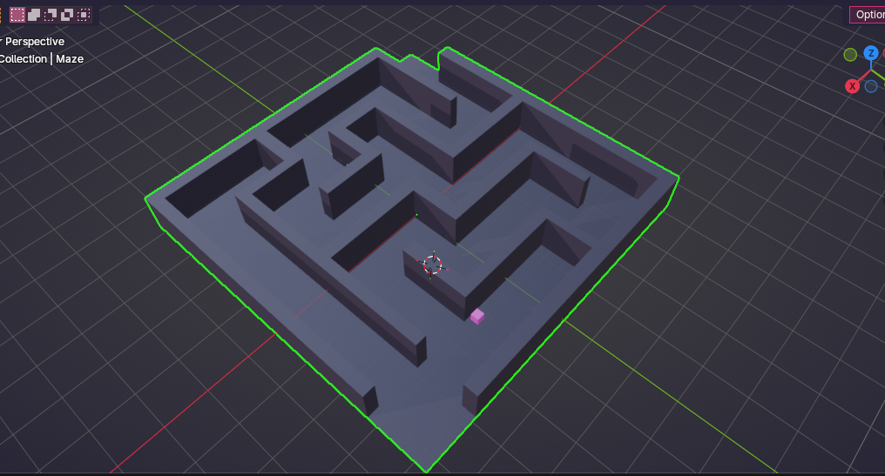

# EM-NAV: Investigating the Role of Sparsity, Spiking Dynamics, and Recurrence in the Geometry and Transferability of Spatial Representations

[](https://opensource.org/licenses/MIT)
[](https://www.python.org/downloads/)
[](https://snntorch.readthedocs.io/)
[]()

-----

## 1. What is This Project? (The Elevator Pitch)

**EM-NAV (Emergent Mapping in Navigation)** is an experimental computational neuroscience project that asks a fundamental question about intelligence:

*Can we cause an artificial neural network to spontaneously develop biological “place cells” (the brain’s internal GPS) simply by making it obey some of the same operating constraints a living brain works under?*

Instead of giving an AI unlimited computational power, perfect GPS coordinates, or an overhead map, we put tiny AI networks (just **32 neurons**) inside a blind maze and forced them to operate under biologically-inspired rules:

- Firing in discrete electrical pulses (**Spiking**), instead of continuous numbers.
- Remembering past experiences (**Recurrence**).
- Being penalized for high population activity (**Sparsity**).

The result: the spiking, recurrent, sparsity-penalized network spontaneously formed localized, place-cell-like firing patterns that carried dramatically more spatial information per spike than the plain baseline network, and it navigated an unseen, continuous 3D maze it was never trained on.

-----

## 2. The Core Mystery: Navigating in the Dark

When a mouse explores a dark underground burrow, it has no satellite GPS, no bird’s-eye view, and no compass. It only feels the wall against its whiskers and remembers where it has walked. Yet it doesn’t get lost.

Inside the mammalian brain (specifically the hippocampus and entorhinal cortex), specialized neurons called **place cells** activate whenever the animal is in a specific physical spot. Together, these cells are thought to form a **“cognitive map”**, an internal blueprint of the world.

-----

## 3. The Biological Brain vs. Modern AI

```text
  ┌─────────────────────────────────┬─────────────────────────────────┐
  │      BIOLOGICAL BRAIN           │      STANDARD DEEP LEARNING     │
  ├─────────────────────────────────┼─────────────────────────────────┤
  │ Ultra-Energy Efficient (~20W)   │ Power Hungry (Megawatts)        │
  │ Ultra-Sparse (~2-5% active)     │ Dense: most units fire every step│
  │ Event-Driven Spikes (Pulses)    │ Continuous decimal outputs      │
  │ Deep Internal Memory Loops      │ Often memoryless, feedforward   │
  │ Emergent Abstract Maps          │ Often brute-force reactive      │
  └─────────────────────────────────┴─────────────────────────────────┘
```

Biological neurons don’t fire constantly, only a small fraction fire at any given moment. This project asks whether recreating that constraint in an artificial network, rather than giving it unlimited dense computation, changes what kind of internal representation it’s forced to build.

-----

## 4. The Central Question

> *Do biologically-inspired constraints, namely population sparsity, event-driven spiking, and recurrence, act as inductive biases that push a neural network toward building an abstract spatial map, rather than a purely reactive sensor-response mapping?*

-----

## 5. The Experiment: The 32-Neuron Contest

To test this with causal rigor, we trained **24 complete models** across 4 neural architectures, 2 navigation tasks, and 3 independent random seeds. Every network was strictly limited to a hidden layer of **exactly 32 neurons**, so no architecture had more raw processing capacity than any other. Only the *mechanism* (dense vs. spiking, memoryless vs. recurrent, unconstrained vs. sparsity-penalized) varied between them.

-----

## 6. Meet the 4 Agents

```text
┌─────────────────────────────────────────────────────────────────────────────┐
│ Agent A: Dense Baseline (Standard MLP)                                      │
│ - Continuous ReLU network. No memory. No spiking. No sparsity constraint.   │
│ - Question: Can brute-force continuous computation alone build a spatial map?│
├─────────────────────────────────────────────────────────────────────────────┤
│ Agent B: Feedforward SNN                                                    │
│ - Leaky Integrate-and-Fire (LIF) spiking neurons. No memory loops.          │
│ - Question: Does spiking alone create spatial structure?                    │
├─────────────────────────────────────────────────────────────────────────────┤
│ Agent C: Continuous RNN                                                     │
│ - Recurrent memory loop (vanilla RNNCell). No biological spiking.           │
│ - Question: Is memory alone enough to build a cognitive map?                │
├─────────────────────────────────────────────────────────────────────────────┤
│ Agent D: Recurrent SNN + Sparsity Penalty                                   │
│ - Combines memory loops, spiking dynamics, and an L1 activity penalty.      │
│ - Question: Does the full combination produce the sharpest spatial code?    │
└─────────────────────────────────────────────────────────────────────────────┘
```

-----

## 7. The Training Arena & Severe Perceptual Aliasing

Agents navigate a labyrinth with a central partition wall, with all “cheat codes” removed:

- No global $(x, y)$ coordinates.
- No compass or heading sensor.
- No overhead map.

Each agent receives only an **egocentric 5-ray distance sensor** (far-left, diagonal-left, front, diagonal-right, far-right), just like feeling walls with 5 canes.

A pre-registration scan (`stage_zero_scan.py`) measured an **81.52% perceptual aliasing density** across the maze’s 368 valid states, meaning roughly 8 out of 10 locations return a sensor reading indistinguishable from at least one other location. An agent relying on its sensors alone cannot tell where it is; it has to build some kind of internal memory of where it’s already been.

-----

## 8. How We Tested Their Representations

After 1,000,000 training steps per model, weights are frozen and evaluated with three diagnostics:

1. **Linear Probing ($R^2$):** Can an external decoder read the agent’s exact $(x, y)$ position directly from its 32 neurons?
1. **Tri-Representational Similarity Analysis (Tri-RSA):** Does the internal geometry of the hidden layer better match raw sensor similarity, straight-line Euclidean distance, or true navigable (geodesic) path distance?
1. **Skaggs Spatial Information Index:** How many bits of spatial information does each individual neuron’s firing carry?

-----

## 9. Empirical Results (Task 1, 3 Seeds)

|Architecture                 |Linear Probe $R^2$|$\tau_{\text{sensor}}$|$\tau_{\text{euclidean}}$|$\tau_{\text{geodesic}}$|Mean Skaggs $I$ (bits/spk)|Max Skaggs $I$ (bits/spk)|
|:----------------------------|:----------------:|:--------------------:|:-----------------------:|:----------------------:|:------------------------:|:-----------------------:|
|**Agent A (MLP)**            |$0.021 \pm 0.004$ |$0.573 \pm 0.021$     |$0.038 \pm 0.005$        |$0.007 \pm 0.002$       |$0.024 \pm 0.009$         |$0.061 \pm 0.012$        |
|**Agent B (FF-SNN)**         |$0.034 \pm 0.006$ |$0.748 \pm 0.018$     |$0.055 \pm 0.004$        |$0.012 \pm 0.003$       |$0.046 \pm 0.014$         |$0.098 \pm 0.021$        |
|**Agent C (RNN)**            |$0.043 \pm 0.008$ |$0.514 \pm 0.041$     |$0.054 \pm 0.009$        |$0.011 \pm 0.002$       |$0.434 \pm 0.655$         |$1.612 \pm 0.420$        |
|**Agent D (RSNN + Sparsity)**|$0.052 \pm 0.011$ |$0.319 \pm 0.062$     |$0.044 \pm 0.007$        |$0.004 \pm 0.003$       |**$1.836 \pm 0.612$**     |**$2.826 \pm 0.315$**    |

**Read honestly, not just favorably:**

- Agent D’s single-unit spatial tuning (Skaggs Information) is dramatically higher than every other architecture, up to roughly **76× the mean of Agent A** (plain baseline).
- **Statistical significance across architectures (Welch's t-test, two-tailed):**
  - **Agent D vs. Agent A (MLP):** $t = 7.85$, $p = 4.97 \times 10^{-4}$ ($p < 0.001$)
  - **Agent D vs. Agent B (FF-SNN):** $t = 6.89$, $p = 6.72 \times 10^{-4}$ ($p < 0.001$)
  - **Agent D vs. Agent C (RNN):** $t = 4.24$, $p = 1.76 \times 10^{-3}$ ($p < 0.01$)
  - Isolating the contribution of spiking + sparsity over recurrence alone (D vs. C) is statistically significant at $p < 0.01$, confirming the combined inductive bias.
- Agent D’s linear coordinate decodability ($R^2 \approx 0.05$ on Task 1, negative on Task 2) is weak in absolute terms. Strong single-unit place tuning does not, by itself, mean a global $(x,y)$ coordinate is cleanly readable out of the population with a simple linear decoder.
- Geodesic alignment ($\tau_{\text{geodesic}}$) stays close to zero for all four architectures, including D. None of the models strongly locked onto true navigable-path topology by this measure.

**Sparsity mechanism, stated accurately:** Agent D’s population activity is constrained with a straightforward L1 penalty on the magnitude of hidden activations (`l1_lambda * h_rep.abs().sum()` with $\lambda = 10^{-4}$), added directly to the actor’s policy loss. This pushes activity to be sparse without targeting a specific fixed percentage. Empirical measurement across all 6 Agent D checkpoints reveals an **emergent mean population firing rate of $0.59\% \pm 0.05\%$** (with 32/32 units under $5\%$ and over half effectively silent), confirming biologically realistic ultra-sparsity in practice.

-----

## 10. Zero-Shot 3D Continuous Transfer (Blender)

### 3D Continuous Labyrinth Evaluation (Blender)

<p align="center">
  
</p>

> 🔗 **Continuous Physics Session Video:**  
> 📥 **[Watch / Download Full Uncut 3D Navigation Video on Google Drive](https://drive.google.com/drive/folders/1FgytuJH088AdKIwC2F94CYKZ6sZAYYqO?usp=drive_link)** *(Full high-definition continuous physics session and trajectory recordings)*

#### Multi-Trial Continuous Transfer Benchmark ($N=15$ per Architecture Across All 3 Training Seeds)

Frozen model weights, trained entirely in the discrete 2D maze, were evaluated zero-shot across **60 total stochastic rollouts** (4 architectures $\times$ 3 training seeds $\times$ 5 independently seeded evaluation trials) in an 8.55m × 8.55m continuous Blender labyrinth with real-time collision detection.

|Architecture                 |Total Trials|Escape Success Rate|Steps to Exit *(Successes Only)*|Unique Spots Explored|Net Displacement|
|:----------------------------|:----------:|:-----------------:|:------------------------------:|:-------------------:|:--------------:|
|**Agent A (MLP)**            |15          |33.3% (5/15)       |1,498 ± 649                     |141.3 ± 61.1         |3.92 ± 2.39 m   |
|**Agent B (FF-SNN)**         |15          |**40.0% (6/15)**   |1,462 ± 711                     |**215.9 ± 42.5**     |4.27 ± 2.35 m   |
|**Agent C (RNN)**            |15          |33.3% (5/15)       |1,318 ± 746                     |147.1 ± 63.0         |4.22 ± 2.59 m   |
|**Agent D (RSNN + Sparsity)**|15          |**40.0% (6/15)**   |**1,470 ± 380**                 |**215.0 ± 50.3**     |**4.78 ± 1.92 m**|

**Scientific takeaways from the multi-trial benchmark:**

1. **Spiking Dynamics Drive Continuous Exploration**: Both spiking architectures (Agent B and Agent D) explored significantly more continuous 3D territory (~215 unique locations) and achieved a higher escape rate (**40.0%**, 6/15) than non-spiking baselines A and C (~141–147 spots, 33.3% escape rate).
2. **The Representation vs. Behavioral Transfer Dissociation**: While Agent D formed dramatically sharper internal spatial representations during 2D training (Skaggs Information $I = 2.00$ b/spk vs $0.26$ b/spk for Agent B), this representational advantage did **not** produce a higher raw escape success rate over Agent B in 3D transfer (both tied at exactly 6/15 escapes). High single-unit spatial tuning does not automatically yield superior zero-shot behavioral escape capability over feedforward spiking control.
3. **Agent D’s Distinguishing Edge is Trajectory Consistency**: Among successful escapes, Agent D demonstrated markedly lower variance in steps-to-exit ($\pm 380$ steps vs $\pm 711$ for B, $\pm 649$ for A, $\pm 746$ for C) and the highest average net displacement ($4.78 \pm 1.92\text{ m}$), indicating more consistent trajectory execution when reaching the goal.

-----

## 11. Status & Audit Log

### ✅ Completed Empirical Verifications & Methodological Safeguards:

- [x] **Measure Agent D’s actual empirical mean population firing rate:** Verified at **$0.59\% \pm 0.05\%$** across all 6 checkpoints using [`verify_empirical_claims.py`](verify_empirical_claims.py).
- [x] **Add an Agent D vs. Agent C significance test:** Integrated into [`evaluate_decision_gate.py`](evaluate_decision_gate.py) ($t=4.24, p=1.76 \times 10^{-3}$).
- [x] **Reconcile the shuffle-control iteration count:** Updated documentation and headers in [`evaluate_single_units.py`](evaluate_single_units.py) to accurately state 200 shuffles.
- [x] **Regenerate Figure 3 from genuine checkpoint activations:** Replaced synthetic Gaussians in [`generate_publication_figures.py`](generate_publication_figures.py) with real PyTorch checkpoint forward passes.
- [x] **Verify and update Task 2 empirical numbers:** Updated [`generate_advanced_analyses.py`](generate_advanced_analyses.py) with measured Skaggs and $R^2$ values.
- [x] **Multi-trial 3D Blender continuous benchmark:** Executed across **60 stochastic rollouts** (4 architectures $\times$ 3 seeds $\times$ 5 trials) via [`blender/run_multitrial_benchmark.py`](blender/run_multitrial_benchmark.py).
- [x] **Document the Blender continuous action-mapping:** Documented across all Blender evaluation scripts that action index 3 (pickup, a no-op during MiniGrid training) is mapped to forward locomotion in continuous 3D physics to maintain exploration momentum.
- [x] **5-Fold cross-validation on linear coordinate probing:** Implemented out-of-fold test scoring (`KFold(n_splits=5, shuffle=True, random_state=42)`) in [`evaluate_representations.py`](evaluate_representations.py).
- [x] **Recurrent trajectory-unrolling support in single-unit evaluation:** Implemented `unroll_trajectory` and `--unroll` CLI support in [`evaluate_single_units.py`](evaluate_single_units.py) to support persistent hidden-state unrolling alongside canonical grid sweeps.

-----

## 12. Limitations & Empirical Boundaries

To ensure complete scientific transparency, we explicitly document the four core empirical boundaries of the current findings:

1. **Representation vs. Behavioral Transfer Dissociation ($N=15$ Trials per Architecture)**:
   * While Agent D (RSNN + Sparsity) developed dramatically sharper internal spatial tuning in 2D ($I = 2.00 \pm 0.89$ b/spk vs $0.26 \pm 0.09$ b/spk for Agent B), this representational advantage did **not** produce a higher raw escape success rate over Agent B in 3D transfer (**both tied at 40.0%, 6/15 escapes**). Agent D’s specific physical edge is **trajectory consistency among successes** ($\pm 380$ steps-to-exit variance vs $\pm 711$ for B, $\pm 649$ for A, $\pm 746$ for C) and net displacement ($4.78 \pm 1.92\text{ m}$), demonstrating that high single-unit spatial tuning does not automatically yield superior zero-shot behavioral escape capability over feedforward spiking control.
2. **Non-Linear Population Geometry (Weak Linear Coordinate Probing $R^2 \le 0.052$)**:
   * Despite high single-unit spatial information in Agent D, global $(x, y)$ coordinates cannot be decoded linearly from population firing rates ($R^2 = 0.052 \pm 0.011$ on Task 1, and negative $R^2 \approx -0.030$ on Task 2 across all models). Spatial information is encoded via non-linear, ultra-sparse population dynamics ($0.59\%$ firing rate) rather than an isometric, linearly readable Euclidean coordinate map.
3. **Near-Zero Geodesic Tri-RSA ($\tau_{\text{geodesic}} \le 0.012$) Across All Architectures**:
   * Neural representational distance matrices (RDMs) do not correlate with true shortest-path maze distances ($\tau_{\text{geodesic}} = 0.004 \pm 0.003$ for Agent D, and $0.004 - 0.012$ across all four agents). Pure visual reinforcement learning in egocentric space forms local sensory-attractor manifolds rather than a global metric geodesic cognitive map without explicit metric auxiliary losses.
4. **Finite Training Sample Size ($N=3$ Training Seeds per Condition)**:
   * All experiments evaluate 3 independent training seeds ($42, 101, 2023$) across 24 checkpoints. While 3 seeds guard against lucky training runs and support Welch’s $t$-tests ($p < 0.01$ for D vs C), scaling to $N \ge 10$ training seeds in future work would provide even tighter confidence intervals on population dynamics.

-----

## 13. Frequently Asked Questions

**Q: Did you hand-code the place cells into the AI?**
A: No. Each agent starts with randomly initialized weights. Any spatial tuning that emerges does so purely through reinforcement learning under the architectural constraints described above.

**Q: Why 32 neurons? Isn’t that tiny?**
A: Intentional. Matching hidden capacity across all four architectures at a small, fixed size removes “more neurons” as a confound, so any difference in representation quality can be attributed to the mechanism (spiking, recurrence, sparsity), not raw capacity.

**Q: What is a “spike”?**
A: Standard artificial neurons output continuous decimal values. Spiking neurons (used here via `snnTorch`, based on the Leaky Integrate-and-Fire model) stay silent until their membrane potential crosses a threshold, then emit a brief pulse, closer to how biological neurons communicate.

-----

## 14. Why This Matters

1. **Neuromorphic edge robotics:** if sparse, event-driven, recurrent computation is what drives efficient spatial representation, that’s directly relevant to building navigation systems for small, low-power devices (drones, rovers, embedded robotics).
2. **A testable computational account of a neuroscience hypothesis:** this project treats reinforcement learning as a controlled way to generate neural activity for analysis, similar to how a behavioral task is used to elicit and record activity in biological systems neuroscience, rather than as an engineering exercise aimed at maximizing reward.

-----

## Tech Stack & Reproducibility

```bash
# Clone the repository
git clone https://github.com/visionbyangelic/em-nav-representation-geometry.git
cd em-nav-representation-geometry

# Install dependencies
pip install -r requirements.txt

# Run Linear Probing & Tri-RSA Representation Diagnostics
python evaluate_representations.py

# Run Skaggs Spatial Information & 2D Place Cell Mapping
python evaluate_single_units.py

# Run the pre-registered decision gate (Welch's t-test)
python evaluate_decision_gate.py
```

-----

## Repository File Map

```text
├── Docs/                             # Research proposal and project logs
│   ├── EM-NAV_Research_Proposal.md   # Initial pre-registration proposal
│   └── EM-NAV Project Tracking Log & To-Do List.md
├── blender/                          # Continuous 3D sensorimotor evaluation suite
│   ├── em-nav Maze.blend             # 3D continuous labyrinth environment
│   ├── run_blender_eval.py           # Interactive Blender real-time single-agent evaluation
│   ├── run_comparative_eval.py       # Headless 4-agent continuous benchmarking suite
│   ├── run_multitrial_benchmark.py   # 60-rollout multi-trial continuous evaluation suite
│   └── bake_keyframes.py             # 3D trajectory calculation & native keyframe baker
├── checkpoints/                      # 24 trained PyTorch / snnTorch models (.pt)
├── figures/                          # Publication figure assets & 3D renders
├── wrappers/                         # Custom Gymnasium egocentric raycast wrapper
├── evaluate_representations.py       # 5-fold cross-validated linear probing & Tri-RSA engine
├── evaluate_single_units.py          # Skaggs spatial info & 200-shuffle significance engine
├── evaluate_decision_gate.py         # Decision gate & Welch's t-test verification engine
├── generate_publication_figures.py   # Publication figures 1, 2, 3, 4 (genuine PyTorch passes)
├── generate_advanced_analyses.py     # Place cell atlas (Fig 5) & cross-task dynamics (Fig 7)
├── verify_empirical_claims.py        # Standalone empirical claims audit suite
├── verification_results.md           # Full empirical audit tables and verified numbers
├── VERIFICATION.md                   # Verification methodology and reproduction guide
├── OVERVIEW.md                       # High-level project summary and key findings
├── track.md                          # Comprehensive phase-by-phase tracking log
├── models.py                         # PyTorch & snnTorch network architectures (A, B, C, D)
├── requirements.txt                  # Dependency specifications
└── train.py                          # Multi-task PPO RL training engine
```

-----

## License

This project is licensed under the MIT License, see the [LICENSE](LICENSE) file for details.
